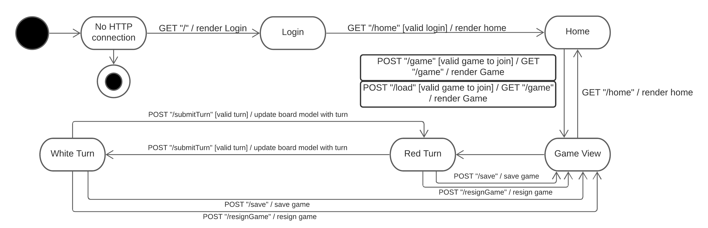

# PROJECT Design Documentation

## Team Information
* Team name: Team 8
* Team members
  * Quentin Ramos
  * Zane Kitchen Lipski
  * Jaden Kitchen Lipski
  * Spencer Creveling
  * David Pritchard

## Executive Summary

The WebCheckers is a web based application that allows players to log in with a unique alphanumeric username and play 
checkers against other players. The user can also play against AI opponents with varying difficulties and save games 
against opponents to play against them at another time.

### Purpose

> The purpose of this project is to make a WebCheckers application in which people could
> play a game of checkers against other online users, and importantly do the project as
> a group in which we communicate via Slack, and update our project status via trello board 
> to keep team members as well as the product owner updated on where their progress is.

### Glossary and Acronyms
> _Provide a table of terms and acronyms._

| Term | Definition |
|------|------------|
| VO | Value Object |
| AI | Artificial Intelligence |

## Requirements

This section describes the features of the application.

### Definition of MVP

> The MVP of this product, should allow players to sign in with an alphanumeric username and play a
> game of WebCheckers against an opponent, In which one of the players wins/loses/resigns.

### MVP Features

> For epics for the MVP we had Game Board, Movement, and Checker Pieces.
> For the Game Board we had to store all the pieces on the board
> For Movement we had to validate all moves that the pieces on the board could do
> For the checker pieces that was to ensure that the player started as the right color
> and could only move their colored pieces

### Roadmap of Enhancements

  >The enhancements that we decided to go with were to add AI opponent with varying difficulties to play against
  >and to add asynchronous play.

  >For the AI opponent enhancement, the user would be presented three varying difficulties on the homepage to 
  >play against. After selecting a difficulty, the AI will reactively submit moves once the user submits their move.

  >For the asynchronous play the user is able to save the game when it is their turn, in which 
  >both players will be exited from the game state and returned to the homepage in which you can 
  >then load the saved game as long as the opponent is not in another game.

## Application Domain

This section describes the application domain.

> The Player is one of the most important entities.
> The player represents a user interacting with our application.
> The player can either play against opponents; the opponent be an AI or another online player.
> Another important entity is the game, which represents a checkers game.
> A game contains a board made of 64 squares with 12 red pieces and 12 white pieces on the board.
> The pieces have certain restrictions on their movement that need to be adhered to.

## Architecture and Design

This section describes the application architecture.

### Summary

The following Tiers/Layers model shows a high-level view of the webapp's architecture.

As a web application, the user interacts with the system using a
browser.  The client-side of the UI is composed of HTML pages with
some minimal CSS for styling the page. There is also some JavaScript
that has been provided to the team by the architect.

The server-side tiers include the UI Tier that is composed of UI Controllers and Views.
Controllers are built using the Spark framework and View are built using the FreeMarker framework.
The Application and Model tiers are built using plain-old Java objects (POJOs).

Details of the components within these tiers are supplied below.

### Overview of User Interface

>This section describes the web interface flow; this is how the user views and interacts
>with the WebCheckers application.

>From the perspective of a user, the user first logs in with a valid
>alphanumeric username. Upon logging in, the user views a list of players they
>are able to challenge, and can challenge one at a time. After challenging a
>listed player, the player is then directed to a game page and the player that
>controls the red pieces moves first and the players then take turns moving. A
>game can be finished when all of a player’s pieces are gone or a player
>resigns.

### UI Tier
> _Provide a summary of the Server-side UI tier of your architecture.
> Describe the types of components in the tier and describe their
> responsibilities.  This should be a narrative description, i.e. it has
> a flow or "story line" that the reader can follow._

> _At appropriate places as part of this narrative provide one or more
> static models (UML class structure or object diagrams) with some
> details such as critical attributes and methods._

> _You must also provide any dynamic models, such as statechart and
> sequence diagrams, as is relevant to a particular aspect of the design
> that you are describing.  For example, in WebCheckers you might create
> a sequence diagram of the `POST /validateMove` HTTP request processing
> or you might show a statechart diagram if the Game component uses a
> state machine to manage the game._

> _If a dynamic model, such as a statechart describes a feature that is
> not mostly in this tier and cuts across multiple tiers, you can
> consider placing the narrative description of that feature in a
> separate section for describing significant features. Place this after
> you describe the design of the three tiers._

### Application Tier
> For our application Tier we have 2 classes, GameManager, and PlayerLobby
> For PlayerLobby we are able to add players into the active pool of online players
> When a player decides to sign out they are removed from this pool of players online
> To prevent multiple users from signing with the same username, PlayerLobby will 
> compare the name they inputted to every other online player
> For The GameManager we can create games between players, in which will put players
> into a game to play against each other and this game will be stored in a pool of active games.
> Once a game has finished the game will be removed from the active pool, also this application
> will be able to load games, if they were already created then saved previously

### Model Tier
> _Provide a summary of the Application tier of your architecture. This
> section will follow the same instructions that are given for the UI
> Tier above._
> 
> Our model tier is the backbone of our WebCheckers project. The WebCheckers Model Tier encapsulates the game
> class which holds AI, Board, Game, Move, Piece, Player, Position, Row, Space.
> For AI we are able to select from 3 different AI from the Homepage, In which the AI will 
> act like a player and makes moves as if another player was making them. 
> The moves that the AI decides are based on a set of preferred moves based on the difficulty selected
> The Board class, stores the board and all the pieces on the board, in which the board will
> determine that when one player has all their pieces missing the other player will become the winner
> For the Game class that will validate moves on the board, as it stores the information of what 2 players 
> are playing each other, or it will store player vs AI.
> For the Move class all it does is determine if a jump or simple move is being made.
> For the Piece class we declare the color of the pieces on the board.
> For the Player class we determine that a player will have a list of saved games and their username stored
> For the Position class we can determine the position of pieces on the board.
> For the Row class we are able to use this class to make rows on the board in combination with the
> Space class that will provide space for pieces to be placed on and determine if spaces are droppable

### Design Improvements
> _Discuss design improvements that you would make if the project were
> to continue. These improvement should be based on your direct
> analysis of where there are problems in the code base which could be
> addressed with design changes, and describe those suggested design
> improvements. After completion of the Code metrics exercise, you
> will also discuss the resulting metric measurements.  Indicate the
> hot spots the metrics identified in your code base, and your
> suggested design improvements to address those hot spots._
> 
> Some possible design improvements that we could make, could be more
> logging, and properly defining our win state for a game within the game model.
> Currently we have very minimal logging, improving our logging would allow
> trouble shooting to be much easier and creates a better understanding of 
> how the program works during operation. Then for our win state, our win state 
> for a game is held within the board connected to a game. This is not that big 
> of a problem for right now because a board and game are 1:1, but this could 
> cause problems if that was different. Moving the win state for a game 
> to a game would remove this possible problem.

## Testing
> _This section will provide information about the testing performed
> and the results of the testing._
> 
> We made sure that whenever we implemented something, that we would live
> test it and make sure it past it's acceptance test. We would then
> make sure that we made unit tests to cover the code.

### Acceptance Testing
> For our Acceptance Testing, we currently pass all of the acceptance criteria tests. There were no concerns
> with any of the acceptance testing for any of the user stories.

### Unit Testing and Code Coverage
>during the development of our test we ended up implementing ToStrings as well as setters
>inorder to help use create ideal scenarios so that we could test as many possible branches.
>we still struggled to reach certain branches however as you will see below we have extensive
>testing coverage. 

>one part that was uniquely challenging to test was the AI as its use of randomness makes
>it harder to test all random outcomes. however by running test multiple times and going through each verrsion of the ai
>we where able to get great AI coverage 

>one part of junit testing that we struggled with was testing branches of the UI tier, we ensure highe covrace to
>be confidante that the functions will work however due to having troubles with mockioto we resulted in a lower
>coverage than initially hoped for

>overall we aimed for over 90% in the 3 major branches appl,model and ui
>as once we reach <90% coverage we can be confidante that the user will most likely not ever encounter an error.

